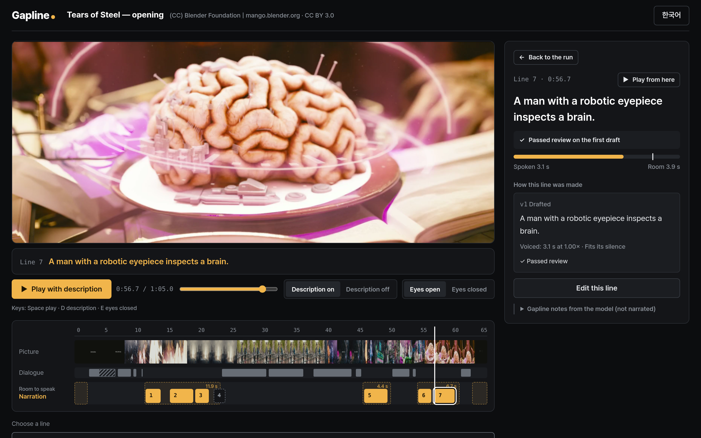
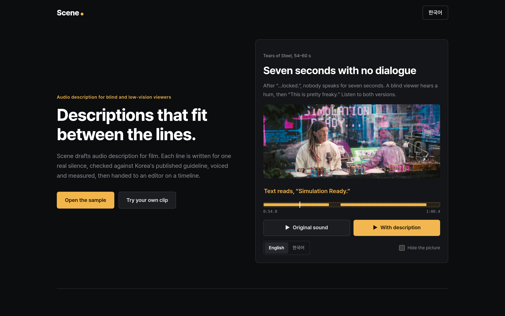
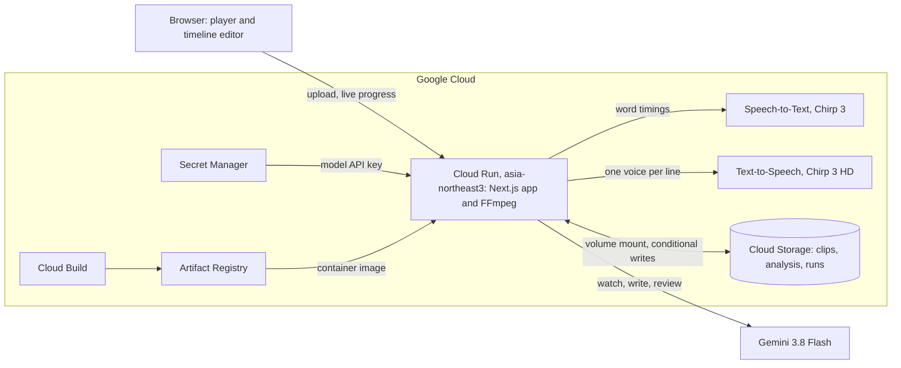

# Scene

**Descriptions that fit between the lines.**

Scene makes audio description, the narration that tells blind and low-vision viewers what is on
screen. One press of Generate runs every step: Scene writes each line for one silence between the
dialogue, checks it against a published audio-description guideline, voices it and measures the voice,
rewrites any line a final check sends back, and mixes the track. It works in Korean and English.

[Live demo](https://scene-ad-958994530029.asia-northeast3.run.app) |
[Architecture](docs/ARCHITECTURE.md) | [Evaluation](docs/EVALUATION.md) | [Deploy your own](docs/DEPLOY.md)

<!-- TODO(submission): add the demo video link (public YouTube, Vimeo or Google Drive, under 3 minutes). -->
<!-- TODO(submission): add the link to the deck PDF. -->

Built for AI Builder Cup 2026, theme _Media, Content & Digital Experiences_.



## The problem

On 3 September 2026, after a ten-year lawsuit, Korea's Supreme Court confirmed that cinemas discriminate
against blind and deaf moviegoers when films lack audio description and captions
([case 2022Da203507](https://www.scourt.go.kr/portal/news/NewsViewAction.work?gubun=6&seqnum=3044&type=0)).
Making one Korean film accessible still takes about three months, about ten specialists and roughly
₩14 million (about US$10,000) for description and captions together
([Barrier-Free Film Committee](https://barrierfreefilms.or.kr/board_hrgp25/682), [2019 interview](https://futurechosun.com/archives/43832)).

## What Scene does

- **Finds the room to speak.** Speech recognition times every spoken word, then listens to each
  silence again on its own. The silences between lines of dialogue, away from story-critical sounds,
  become the only places narration may go.
- **Writes each line and checks it against the guideline.** Gemini watches the clip and writes each
  line for one named silence. A separate review pass checks it against eight rules taken from Korea's
  accessible-broadcasting guideline and Netflix's audio-description style guide. Every rejection names
  its rule and the page it comes from.
- **Voices, measures and fixes.** A Google voice speaks each line, and the length of that audio, not a
  word count, decides whether it fits. A final check reviews exactly what will be heard; Scene rewrites
  the lines it sends back and can add a line where a silence still has free room, then mixes the
  track.
- **Leaves every line open.** Want different words? You can still edit any line on the timeline;
  Scene re-voices just that one and checks the track again.

## Try it in 60 seconds



1. Open the [live demo](https://scene-ad-958994530029.asia-northeast3.run.app). It starts with seven
   seconds of _Tears of Steel_ where nobody speaks. Play **Original sound**, then **With description**,
   and turn on **Hide the picture** to hear it the way a blind viewer would.
2. Choose **Open the sample** for the full 65 seconds, with Korean and English tracks. Press play, turn
   on **Eyes closed**, and switch **Description off** and on to compare. The Korean track came from
   one automatic run: seven lines, each inside its silence, one of them rewritten by Scene after the
   final check sent it back.
3. Select a narration line on the timeline. You see what the model saw in the scene, every draft, the
   rule that rejected a draft with its guideline page, and the voiced length against the room it had.
4. Choose **Try your own clip** and upload up to 90 seconds and 30 MB. A new track takes several minutes.
   New tracks share a daily allowance on the public demo; when it runs out, the sample keeps playing.

## How the AI works

The model decides what to say. Plain code decides where it may be said, whether a line is accepted,
how long it takes to say, and when to stop trying.

1. **Hear.** Speech-to-Text (Chirp 3) returns a start and end time for every spoken word.
2. **Re-listen.** Every silence long enough for a line is cut out with half a second on each side and
   recognized again on its own, three at a time. Any word heard there turns that stretch back into
   speech. Over a long stretch of audio a recognizer can attach a phrase to the wrong moment; a short
   slice keeps it where it is spoken. Hearing never waits for watching; the two run side by side.
3. **Watch.** Gemini 3.8 Flash watches the whole clip, picture and sound. It maps shots, on-screen
   text, key sounds, and people, with the second each name is first spoken.
4. **Find room.** Code removes speech and story-critical sounds from the timeline, keeps a 0.25 s margin
   around them, and skips silences shorter than 1.2 s.
5. **Write.** Gemini writes each line for one named silence, sized to its room: Korean is counted in
   syllables and English in words, calibrated on the narrator's measured pace. A line that starts
   outside the silence it names is dropped, never moved.
6. **Review.** A separate pass, with its own prompt and rubric, checks every line against the eight
   rules below and lists important moments no line covers. A rejected line is rewritten from the
   reviewer's own fix and reviewed again, up to twice. If it fails a third review, or a rewrite changes
   nothing, it is dropped.
7. **Voice and measure.** Text-to-Speech (Chirp 3 HD) speaks each line and Scene measures the audio it
   gets back. A line that is too long but would fit at up to 1.15× speed is voiced again that much
   faster. Otherwise Gemini shortens it (at most twice), the shorter line goes back through review with
   one rewrite left, and it is voiced again. A line that still does not fit is dropped.
8. **Final check.** The reviewer audits exactly the lines that will be heard, once. It lists lines that
   break a rule and moments the finished track still misses.
9. **Fix.** Scene rewrites each failing line from the check's fix, and writes a new line for a missing
   moment where its silence still has free room: from 0.3 s after the last voiced line before it, at
   least 1.0 s. Both are reviewed and voiced like any other line. The track is not audited a second
   time; the check's list is updated with the fixes. What it still lists, such as a moment with no free
   silence left, stays in the result, which reads **Final check · notes**, or **Final check passed**
   when nothing is listed.
10. **Mix.** FFmpeg lowers the film by 9 dB under each line and sets the narration to −16 LUFS. You get
    a described MP4, a narration WAV, a WebVTT text track and a JSON script with every version and
    verdict.
11. **Edit (optional).** You can rewrite or move any line, bring back one the loop dropped, or remove
    one. A rewritten line is voiced at normal speed and the whole track is reviewed again. If it runs
    long or breaks a rule, Scene returns the reason and leaves your words as they are. A removal voices
    nothing: the other lines keep their audio byte for byte, and the final check runs again on what is
    left, so anything only that line covered is listed as missing. Every edit makes a new version and
    keeps the old one.

Every model call returns JSON checked against a schema, and every call is logged with its cost. One bad
answer does not end a run: output that does not match its schema is asked for once more, as is a
review that skips a line or names one it was not given, and a Text-to-Speech call that fails with a
busy or server error is retried once. A rewrite or shortening the writer leaves out drops that line
instead; a fix left out after the final check leaves the line as it was voiced. The browser follows the
run live over server-sent events.

Line 5 of the Korean sample track (23 September), in the room from 47.2 s to 49.83 s, where the
screen reads "MEMORY PLAYBACK":

| Step        | Line                                                             | What happened                                                                                                                                                             |
| ----------- | ---------------------------------------------------------------- | ------------------------------------------------------------------------------------------------------------------------------------------------------------------------- |
| Draft       | "홀로그램 재생창이 뜬다." (A hologram playback window comes up.) | Passed review and was voiced in 2.32 s.                                                                                                                                   |
| Final check | the same line                                                    | Sent back, _Viewer or camera framing_ (KMCC p.8–9): "뜬다" (comes up) frames it from the screen's side. Fix: read the text that appears on screen, like "전체 기억 재생." |
| Fix         | "전체 기억 재생." (Full memory playback.)                        | Rewritten by Scene from the check's fix. Passed review and was voiced in 1.74 s of its 2.63 s of room, before the mix.                                                    |

Not every fix works. At 63.0 s the reviewer rejected "화면이 암전된다." (The screen goes black.) and
"암전된다." (Goes black.) as viewer framing, then "남자가 뇌를 응시한다." (The man gazes at the brain.) as
redundant and inconsistently named. Its last fix repeated the words it had rejected one round
earlier, although it is told that every fix must itself pass all eight rules. After two rewrites Scene
dropped the line rather than voice it.

### The review rules

Each rule points at a clause of a published guideline, so every decision can be checked against its
source. The rules live in [`src/lib/pipeline/guidelines.ts`](src/lib/pipeline/guidelines.ts).

| Rule                             | A line fails when it                                                                                                                              | Source                                                                                                                                                                                               |
| -------------------------------- | ------------------------------------------------------------------------------------------------------------------------------------------------- | ---------------------------------------------------------------------------------------------------------------------------------------------------------------------------------------------------- |
| Reveals too early                | names a person, or reveals a plot point, before the film does (on-screen titles and signs are fine)                                               | KMCC p.7 (characters); Netflix §1.2                                                                                                                                                                  |
| Not on screen                    | states anything the clip does not show or let you hear, including outside knowledge of the film                                                   | KMCC p.8 (nothing beyond the picture), p.10 (review)                                                                                                                                                 |
| Interprets instead of describing | names an emotion or judgment instead of the action or expression that shows it                                                                    | KMCC p.9 (behaviour, not feelings); Netflix §1.2                                                                                                                                                     |
| Tense or person                  | is not in present tense and third person                                                                                                          | KMCC p.8 (present tense, neutral third person); Netflix §1.2                                                                                                                                         |
| Viewer or camera framing         | says "we see" or "appears on screen", or uses camera jargon the story does not need                                                               | KMCC p.8–9 (avoid "is seen" phrasing and camera terms)                                                                                                                                               |
| Inconsistent naming              | calls a person or object something different from earlier lines                                                                                   | KMCC p.9 (consistent names)                                                                                                                                                                          |
| Redundant or low priority        | repeats what the dialogue or an obvious sound already says, or spends the room on something minor while something more important goes undescribed | KMCC p.7 (must describe characters, place, time, movement, unidentifiable sounds, on-screen text), p.8 (no description for sounds recognised at once or feelings the dialogue conveys); Netflix §1.2 |
| Unclear or overloaded            | is incomplete, ambiguous, hard to follow by ear, or crammed with detail                                                                           | KMCC p.9 (complete, clear, concise)                                                                                                                                                                  |

KMCC is the Korea Media and Communications Commission guideline for accessible broadcasting
([장애인방송 프로그램 제공 가이드라인](https://www.kmcc.go.kr/download.do?fileSeq=62457), section 2,
audio description, pages 6–10). Netflix is the
[Audio Description Style Guide v2.5](https://partnerhelp.netflixstudios.com/hc/en-us/articles/215510667).
Most KMCC clauses are recommendations, so Scene uses them as a review checklist.

## Architecture on Google Cloud



<!-- GEMINI_ACCESS_LABEL: keep the line below in step with GEMINI_ACCESS_LABEL in src/lib/models.ts. -->

**Gemini access:** Gemini 3.8 Flash — currently via OpenRouter during development; moving to the Gemini API (Google AI Studio).

| Service                                   | What it does in Scene                                                                                                                                                                                                 |
| ----------------------------------------- | --------------------------------------------------------------------------------------------------------------------------------------------------------------------------------------------------------------------- |
| Cloud Run (second-generation environment) | Runs the Next.js app and FFmpeg in one container. Streams each run's progress to the browser.                                                                                                                         |
| Speech-to-Text v2, Chirp 3                | Times every spoken word. Called at the `us` multi-region, where Chirp 3 is served.                                                                                                                                    |
| Gemini 3.8 Flash                          | Watches the clip, writes and rewrites lines, reviews them and runs the final check, with a reasoning level set per stage.                                                                                             |
| Text-to-Speech, Chirp 3 HD                | Speaks each line with one narrator per language. Scene measures the returned audio.                                                                                                                                   |
| Cloud Storage                             | Holds clips, saved analysis and every run, mounted into Cloud Run as a volume. The daily allowance and edit requests use conditional writes, so two instances cannot spend the same money or run the same edit twice. |
| Secret Manager                            | Holds the model API key.                                                                                                                                                                                              |
| Cloud Build and Artifact Registry         | Build the container from source on every deploy.                                                                                                                                                                      |

More detail, including the review, fit and fix loops, is in [docs/ARCHITECTURE.md](docs/ARCHITECTURE.md).

## Results

On 22 September 2026 we ran Scene on six openly licensed clips with its default settings. These runs
predate the fix step and the second automatic rewrite (added on 23 September), and we have not re-run
them since.

| Clip                                       | Narration | Result         | Lines in the finished track      | Time and API cost |
| ------------------------------------------ | --------- | -------------- | -------------------------------- | ----------------- |
| _Tears of Steel_ opening, 65 s             | Korean    | Described      | 5                                | 5 min 49 s, $0.24 |
| _Tears of Steel_ city scene, 45 s          | English   | Described      | 9                                | 3 min 39 s, $0.17 |
| _Tears of Steel_ lab scene, 45 s, held out | English   | Described      | 3                                | 4 min 1 s, $0.17  |
| Korean interview, 45 s                     | Korean    | Described      | 1 (only 2.5 s of usable silence) | 3 min 11 s, $0.13 |
| Korean interview, a later 40 s, held out   | Korean    | Stopped safely | none                             | $0.02             |
| Synthetic colour-and-beep clip, 30 s       | Korean    | Stopped safely | none                             | $0.01             |

- **4 of 6 clips produced a described track.** On the other 2, the speech recognizer returned words
  whose start and end times were identical, and Scene stopped instead of guessing where the silences
  were. Scene now treats such a stretch as speech: the clip keeps less room to speak, and no silence is
  invented.
- **All 18 lines in the four finished tracks fit their room by measured audio**, and none overlaps the
  speech Chirp 3 recognized. One of them still talks over dialogue that Chirp 3 had placed elsewhere.
- **The recognizer put one call about 2 s early.** In the opening, Chirp 3 timed "We have main engine
  start." at 2.32–3.96 s and missed the "Roger, Roger" spoken in that stretch. faster-whisper places the
  call at 4.21–6.17 s over the whole clip and at 4.40–6.16 s when that stretch is recognized on its
  own, and a spectrogram shows voice at 4.8–6.3 s. Chirp 3 placed the countdown after it correctly. So
  the line "망고 오픈 무비 프로젝트." (The Mango Open Movie Project.), at 4.50–6.39 s, talks over the
  call. Scene now re-listens to every usable silence (step 2 above). On 23 September it ran on the real
  audio: of 6 silences recognized again, one held 5 new words, "We have main engine start" at
  3.71–6.47 s, and that closed the 2.38 s silence at 4.21–6.59 s, so no line can be placed there. The
  seven lines in the current sample track overlap neither recognizer's words.
- **With the default reviewer, both scored film clips kept every fixed essential fact.** A cheaper
  reviewer setting lost the "40 years later" time jump in the opening without listing it as missing,
  and marked the Korean interview as checked while both of its essential facts were absent. We kept
  the stricter reviewer.
- **Scene reports what it missed.** In all four finished tracks the final check listed moments still
  missing. Since 23 September a fix step (step 9 above) can add lines for that list where silence is
  still free, and keeps the rest in the result. On the sample track it rewrote one line and added
  none. Of the 3 moments it still lists, 2 have no free silence left. The credit at 2.0 s had 1.0 s
  of free room, yet no line was added there; we have not checked why.
- **A 45–65 second clip took about 3–6 minutes and $0.13–0.24 in API calls** when nothing had been
  analysed before. The sample track, with the fix step and the second rewrite, took 8 min 6 s and $0.32.
  Its hearing and watching came from an earlier run of the same clip, which adds 25 s and $0.04: $0.36
  in all, or $0.33 per minute of film. Hosting and storage are not included.

The method, references and every number are in [docs/EVALUATION.md](docs/EVALUATION.md) and
[`evals/`](evals/).

## What's different

Fitting narration into dialogue gaps by measured voice length is not new:
[MediaScribe](https://www.mediascribe.ai/platform/audio-descriptions) summarizes and re-voices lines
that overrun, and Microsoft's open-source
[ai-audio-descriptions](https://github.com/microsoft/ai-audio-descriptions) speeds lines up to 1.15×
and stops when they still overflow. [ViddyScribe](https://viddyscribe.com/), a 2024 Gemini API
Developer Competition winner, already describes video in Korean. What Scene adds:

1. **Every rejection cites a written rule.** The reviewer's eight rules come from Korea's
   accessible-broadcasting guideline and Netflix's style guide, and every rejected line shows the page
   it breaks. Korean lines are written in the broadcast register and sized in syllables.
2. **One gate for everything that gets voiced.** Drafts, automatic rewrites and shortenings, and the
   fixes made after the final check all pass the same review, and ship only if their measured audio
   fits.
3. **It rewrites what the final check sends back, and lists what it could not fix.** The final check
   reviews the finished track once. Scene rewrites the lines it fails and can add lines for missing
   moments where silence is still free; anything left, such as a moment with no free silence, stays
   listed in the result instead of being hidden behind a pass.

Competitor facts are from their public pages as of 23 September 2026.

## Known limitations

- **Short clips only.** Scene takes clips up to 90 seconds and 30 MB and processes each one within a
  single request. Feature films would need a job queue.
- **The reviewer is a model.** It is the same model as the writer, with its own prompt and rubric, and
  it can be wrong. That is why every result lists what the final check could not fix, and every
  rejection cites the page it rests on.
- **Speech timing comes from one recognizer.** Over a long stretch, Chirp 3 can attach a phrase to the
  wrong moment, as it did with the launch call in the opening. The per-silence re-listen is built to
  catch this. On this clip's real audio it did, on 23 September; it has not yet been checked on other
  clips. Words that Chirp 3 returns without usable times are treated as speech, which can leave less
  room to describe.
- **Not yet tested with blind or low-vision listeners.** Listening sessions, and asking professional
  describers how many lines of an automatic track they would change, are our next steps.

## Run it locally

You need:

- Node.js 20.9 or newer.
- FFmpeg with libx264, AAC, FLAC and the `ebur128` filter. A full static build works; point
  `FFMPEG_PATH` at it. The demo-video builder in `scripts/demo/` also needs libass.
- A Google Cloud project with billing and the Speech-to-Text and Text-to-Speech APIs enabled.
- The gcloud CLI with a named configuration whose account can use those APIs in that project (for
  example `roles/speech.client` and `roles/serviceusage.serviceUsageConsumer`):
  `gcloud config configurations create scene && gcloud auth login`.
- A key for the Gemini calls, in the variable listed in `.env.example`. <!-- GEMINI_ACCESS_LABEL -->

```sh
npm ci
cp .env.example .env.local   # fill in the values described below
npm run samples              # downloads Tears of Steel (about 370 MB) once and cuts the 65 s sample
npm run dev                  # http://127.0.0.1:21960
npm test                     # deterministic tests, no paid calls
npm run test:media           # the FFmpeg workflow with mocked providers
npm run typecheck
```

In `.env.local`, set the model API key, `GCP_PROJECT_ID` (your project), and `GCLOUD_CONFIGURATION`
(the gcloud configuration name). `FFMPEG_PATH` is optional and defaults to `ffmpeg` on your path.
`DATA_DIR` defaults to `./runtime`, and `DAILY_BUDGET_USD` caps API spending per UTC day (default 5).

A fresh clone has no finished tracks. Generate one from the page, or from the command line with
`npm run pipeline -- tos-opening ko standard` (on 23 September, $0.32 in API calls for the sample
with its analysis already saved; hearing and watching it the first time added $0.04). Uploaded clips
and generated files stay in `runtime/`, which Git ignores. `npm run relisten -- tos-opening` runs only
the two hearing passes on a clip's real audio and prints the speech and silences before and after,
without changing the project (about $0.02 of Speech-to-Text).

## Deploy your own

[docs/DEPLOY.md](docs/DEPLOY.md) lists the APIs, bucket, service accounts and secret, then deploys with
`bash deploy/cloud-run.sh`.

## Repository map

```text
src/lib/pipeline/   the loop: hear, re-listen, watch, find room, write, review, voice, check, fix (run.ts)
src/lib/runs/       starting runs, line edits and removals, the daily allowance
src/lib/store/      projects, uploads, access cookie, conditional writes
src/lib/media/      FFmpeg: watching copy, narration track, mix and loudness
src/lib/llm/        the Gemini client and the per-call cost log
src/app/            pages and API routes (upload, runs with live progress, edits, media)
src/components/     landing page, player, timeline editor
src/i18n/           English and Korean interface text
scripts/            sample preparation, pipeline CLI, evaluation, demo video
evals/              evaluation cases and results
tests/              deterministic tests and an FFmpeg workflow test
deploy/             Cloud Run deploy script
docs/               architecture, evaluation, deployment
```

## Credits

- Sample film: _Tears of Steel_, (CC) Blender Foundation | [mango.blender.org](https://mango.blender.org/),
  [CC BY 3.0](https://creativecommons.org/licenses/by/3.0/).
- Evaluation clips: Wikitongues / Teddy Nee,
  [Hanbid speaking Korean](https://commons.wikimedia.org/wiki/File:WIKITONGUES-_Hanbid_speaking_Korean.webm),
  [CC BY-SA 4.0](https://creativecommons.org/licenses/by-sa/4.0/). Used for evaluation only; the
  clips are not in this repository.
- Font: [Pretendard](https://github.com/orioncactus/pretendard), SIL Open Font License 1.1.
- Review rules cite the KMCC accessible-broadcasting guideline and the Netflix Audio Description
  Style Guide v2.5.

## License

The author has not chosen a license yet. Until a LICENSE file is added, all rights are reserved.
