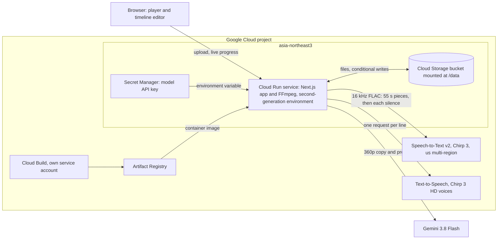
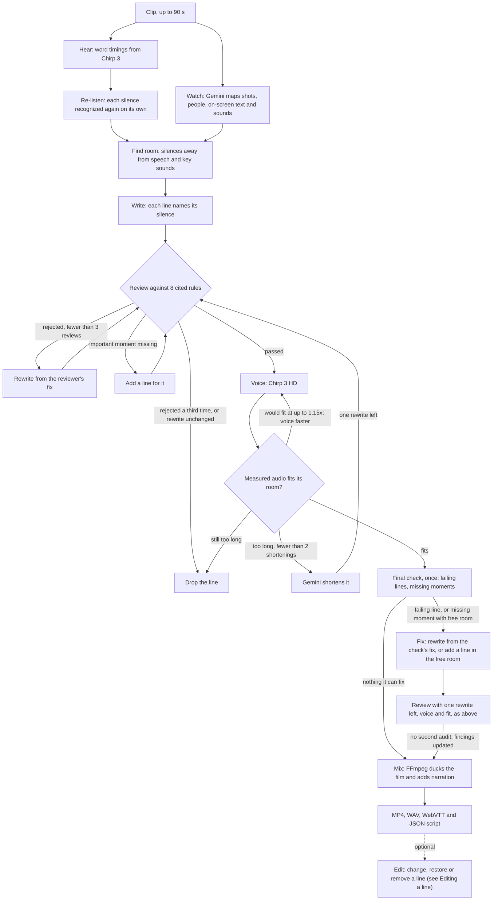
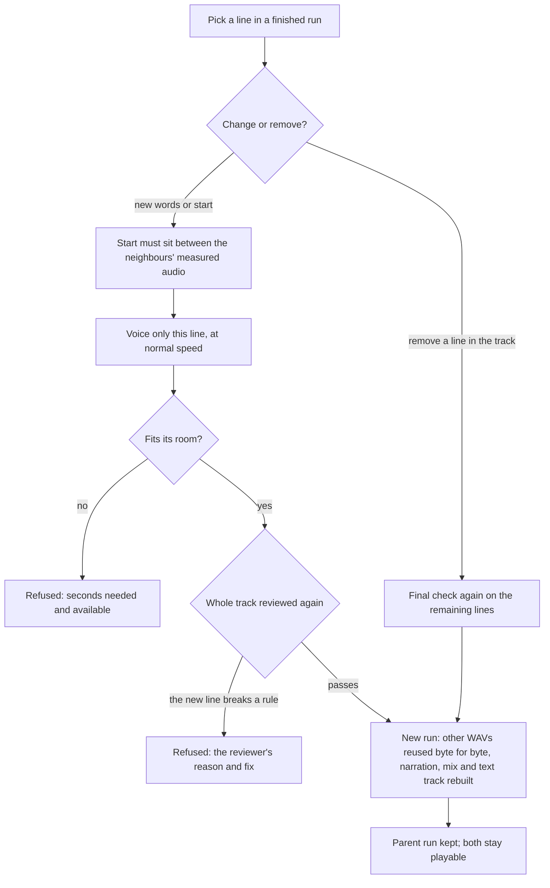

# Architecture

Scene is one Next.js 16 application with FFmpeg in the same container, deployed on Cloud Run. A clip
of up to 90 seconds goes in; a described film, a narration track, a text track and a full review log
come out. This page covers what runs where, the loop that makes each line, how an optional edit or
removal is applied, and how work and money are protected.

## What runs on Google Cloud

<!-- GEMINI_ACCESS_LABEL: keep the line below in step with GEMINI_ACCESS_LABEL in src/lib/models.ts. -->

**Gemini access:** Gemini 3.8 Flash — currently via OpenRouter during development; moving to the Gemini API (Google AI Studio).

- **Cloud Run.** One service in `asia-northeast3`, second-generation execution environment, 2 vCPU,
  2 GiB, up to 10 requests per instance, a 15-minute request timeout, 0 to 2 instances, startup CPU
  boost. The container is Node.js 20 on Debian with the distribution's FFmpeg (libx264, AAC, FLAC,
  `ebur128`). A run lives inside the request that started it and streams its events to the browser; a
  15-second heartbeat keeps the connection open. If the viewer disconnects, the run keeps going and
  its result is saved.
- **Cloud Build and Artifact Registry.** `gcloud run deploy --source` uploads the source, Cloud Build
  builds the `Dockerfile` as a dedicated build service account, and the image lands in Artifact
  Registry before Cloud Run rolls it out.
- **Cloud Storage.** One regional bucket is mounted into the service at `/data` as a Cloud Storage
  volume. Projects, saved analysis and runs are plain files there. The two records that must never be
  written twice, the daily allowance and edit claims, go through the Cloud Storage API with
  generation preconditions (`ifGenerationMatch`), because a mounted bucket has no file locks.
- **Speech-to-Text v2, Chirp 3.** Scene sends the soundtrack as 16 kHz mono FLAC in pieces of 55
  seconds that overlap by 5 seconds, because synchronous recognition takes about a minute of audio per
  request. Each overlap is split at its midpoint. Calls go to the `us` multi-region endpoint
  ([`src/lib/pipeline/hear.ts`](../src/lib/pipeline/hear.ts)), since Chirp 3 is served from the `us`
  and `eu` multi-regions.
- **Re-listen, also Chirp 3.** After that first pass, Scene finds the silences from speech alone and
  recognizes every one of at least 1.2 s again on its own: FFmpeg cuts it out with 0.5 s of padding
  on each side (a longer silence in parts, so no slice exceeds 55 s), and the same request goes out
  for each slice, three at a time
  ([`src/lib/pipeline/relisten.ts`](../src/lib/pipeline/relisten.ts)). A timed word heard inside the
  silence is added as speech marked as found on re-listen; if any word in a slice comes back without
  timing, that whole part of the silence is blocked. The extra seconds are billed and logged under
  hearing. Why: on 2026-09-23 we found that over its 55 s piece of the Tears of Steel opening, Chirp 3
  had put "We have main engine start." at 2.32–3.96 s. faster-whisper places it at 4.21–6.17 s on
  the whole clip and at 4.40–6.16 s on a 4.4–6.7 s slice, inside a 4.21–6.59 s "silence" that a line
  had been written for. A test replays that case from the recorded first pass. On 2026-09-23 the
  re-listen ran on the real audio for the first time. Of 6 silences recognized again, one held new
  words: "We have main engine start" at 3.71–6.47 s, which closed the 4.21–6.59 s silence (2.38 s).
  `npm run relisten -- tos-opening` repeats that check without changing the project.
- **Text-to-Speech, Chirp 3 HD.** One narrator per language, `ko-KR-Chirp3-HD-Charon` and
  `en-US-Chirp3-HD-Charon`, as 24 kHz mono WAV. Scene trims silence below −45 dBFS and takes the
  remaining length as the spoken length.
- **Gemini 3.8 Flash.** Every call streams, returns JSON that must match a schema, and is validated
  again on arrival; an answer that does not is asked for once more. Reasoning is set per stage:
  writing at medium, rewriting at low, reviewing at high, watching at the model default. Writer and
  reviewer watch the same 360p copy of the clip.
- **Secret Manager.** Holds the model API key, exposed to the service as an environment variable.
- **Identity.** On Cloud Run, Google API calls use the service account's token from the metadata
  server. Locally they use the gcloud CLI configuration named in `GCLOUD_CONFIGURATION`.

## The loop that makes each line

The model decides what to say. Code decides where it may be said, whether a line is accepted, how long
it takes to say, and when to stop trying. [`src/lib/pipeline/run.ts`](../src/lib/pipeline/run.ts)
drives the loop, including the final check and the fix after it; its stages sit next to it:
`analyze.ts` (hear, re-listen, watch), `cues.ts` (placing lines, and free room in a voiced track),
`fit-voice.ts` (voicing and fitting) and `finish-run.ts` (mix and summary). One press of Generate
runs every stage through to the mixed track; editing a line afterwards is optional.

1. **Hear and watch run at the same time.** Hearing is the first pass and then the re-listen of each
   silence, which needs only the speech, so it never waits for watching. Each result is validated
   and saved as soon as it arrives, so a later failure does not throw it away.
2. **Find room.** Speech and sounds the watch stage marks as story-critical are blocked, each widened
   by 0.25 s. Only silences of at least 1.2 s remain. KMCC guideline p.10 names dialogue and important
   sound effects as the areas narration must not cover; this step enforces that against the speech
   the two hearing passes found.
3. **Write.** The writer sees the clip, the silences with times to the hundredth of a second, the
   transcript, when each name is first spoken, and the eight rules. Each line gives the silence it
   belongs to and a start time. A start outside that silence is dropped, never moved to another
   silence. A line's room runs to the next line in the same silence or to the silence's end; less than
   1.0 s of room means the line is dropped. The length budget is 5.0 Korean syllables or 2.5 English
   words per second, below the narrator's measured 5.64 syllables and 2.82 words per second.
4. **Review.** The reviewer checks each line and returns, for every violation, the rule, the exact
   words and a reason, plus a suggested fix. An answer that skips a line or names a line that does not
   exist is asked for once more; one that contradicts itself fails its schema and is also asked for
   once more. A second bad answer ends the run. On the first pass over the whole script the reviewer
   also lists important moments no line covers, each placed in a silence; the writer adds lines for
   them and they are reviewed like the rest. A rejected line is rewritten from the reviewer's own fix
   and reviewed again, up to two rewrites (`MAX_REVIEW_ROUNDS` is 3). A third rejection drops the
   line, as does a rewrite with the same words or one the writer leaves out (reason `unchanged`).
5. **Voice and measure.** Up to four lines are voiced at once; a Text-to-Speech call that fails with a
   rate limit or server error is retried once. If a line is longer than its room but would fit at up
   to 1.15× speed, it is voiced again at that speed. Otherwise the writer shortens it to aim at 90% of
   the room, the shorter text is reviewed again with one rewrite left, and it is voiced again. After
   two shortenings a line that still overruns is dropped, and so is a line whose shortening the writer
   leaves out.
6. **Final check.** The reviewer sees exactly the lines that will be heard, with their measured end
   times, once. It returns a verdict for each line and lists essential moments that are still missing
   even where no room is left.
7. **Fix what the check found.** This stage runs only when the check found something it can act on.
   Each failing line is rewritten from the check's fix, with its whole room available. Each missing
   moment whose silence still has free room gets a new line, one per stretch of free room: free room
   starts 0.3 s after the end of the last voiced line before the moment and runs to the next line or
   the end of the silence, and it must be at least 1.0 s (`freeRoom` in `cues.ts`). Both kinds are
   reviewed with one rewrite left, then voiced and fitted like any other line. If the writer leaves a
   rewrite out, the line stays as voiced and its failing verdict stays listed. The track is not
   audited a second time: on the sample, a second audit took over 3 minutes and only listed new items
   it could not act on. Instead the check's findings are updated with the fixes and saved as
   `summary.finalReview`, and `summary.finalFix` records `{ failing, missing, rewritten, added }`.
   What still stands, a fix that failed or a moment with no free silence, stays in the summary. The
   result reads _Final check passed_ when nothing is listed and _Final check · notes_ otherwise, and
   the screen marks each listed moment that has no free silence left.
8. **Mix.** Narration is normalized to −16 LUFS, close to the sample's dialogue level. The film is
   lowered by 9 dB under each line with 0.15 s ramps. Outputs: a described H.264/AAC MP4, the narration
   WAV, a WebVTT text track and `script.json` with every version, verdict and measured length.

Every run writes two logs: `events.jsonl`, the append-only story of the run that the browser replays,
and `ledger.jsonl`, one line per paid call with tokens, latency and cost, failed calls included.

## Editing a line

Editing is optional. You can change a line's words, its start time, or both, including a line the
automatic loop dropped, or remove a line from the track. This flow does not run the fix stage. The code is in
[`src/lib/runs/edit-run.ts`](../src/lib/runs/edit-run.ts).

1. The allowed start range comes from the neighbouring lines' measured audio: after the previous line
   finishes, before the next one starts, inside the same silence.
2. Only the edited line is voiced, at normal speed. If it runs past its room, the edit is refused with
   the exact seconds needed and available.
3. The whole final script is reviewed again with measured end times. If the new line breaks a rule,
   the edit is refused with the reviewer's reason and fix. Scene never rewrites words typed by hand.
4. An accepted edit becomes a new run that points to its parent. The other lines' WAV files are
   reused byte for byte, the mix and text track are rebuilt, and the before and after text is recorded.
   The original run is kept.
5. Each edit carries a request ID, claimed with a conditional write. Repeating the same request returns
   the same result; reusing the ID for a different edit is refused.

A line that is in the track can also be removed (`{ cueId, action: "remove", requestId }`, same
route, same request-ID rules). Nothing is voiced: the line keeps its history with a last version marked
removed, the other lines' WAV files are reused byte for byte, the narration, mix and text
track are rebuilt without it, and the final audit runs again on what remains, so anything only that line
described is listed as missing. A removed line can be put back with an ordinary edit, its own words
included. Both kinds of edit share [`src/lib/runs/edit-track.ts`](../src/lib/runs/edit-track.ts).
This is how the line over the opening's launch call was taken out of the sample's earlier, edited
track ([evaluation](EVALUATION.md#edits-on-the-earlier-sample-track)).

## Saving work and reusing analysis

- Speech and scene analysis are saved separately under a key that hashes the clip's bytes, its spoken
  language, its length, the model and the analysis version. A new run on the same clip, in either
  narration language or density, reuses them; a changed clip or model does not.
- Runs never change after they finish. Each edit is a new run, so every version can be played and
  downloaded.
- Uploads are normalized to H.264/AAC, with neither side over 1280 px, before analysis.

## Access and spending

- **Samples are public; uploads are private to the browser that made them.** An upload sets a random
  256-bit token in an HttpOnly, SameSite=Strict cookie that lasts 30 days, and the project stores only
  the token's SHA-256 hash. Every route that reads or changes a project checks it, and changes must come
  from the site's own pages. The media route serves only the clip, poster, thumbnail strip, each run's
  four outputs and its per-line WAVs.
- **Every paid call is covered before it starts.** A run or an edit reserves an amount against the
  daily allowance (`DAILY_BUDGET_USD`), and each call inside it reserves its own maximum before it is
  sent. When the run ends, the reservation settles to the charges the providers reported. A charge that
  could not be read keeps its full reservation. The allowance lives in the bucket and is updated with
  conditional writes, so two instances cannot spend the same money. Hosting, storage and network costs
  are outside this API total.
- **Provider hiccups and bad answers.** A rate-limited or unavailable model call is retried once when
  the provider asks for a short wait. A longer wait ends the run with an error that says to try
  again, instead of holding the request open. Model output that is not valid JSON for its schema is
  retried once, and a review that names unknown lines or skips one is asked for once more. A
  retryable Text-to-Speech failure is retried once. A rewrite or shortening the writer leaves out
  drops that line (reason `unchanged`) instead of failing the run; in the fix stage it keeps the line
  as voiced. Every model attempt, failed ones included, is logged with its cost.

## Tests

- `npm test` runs deterministic tests, with no paid calls: silence finding, placement, length budgets,
  silence trimming, free room for a line added after the final check, replaying a run from its
  events, review validation, untimed words in a recorded Chirp 3 response, the re-listen (slicing,
  words at a silence's edge, untimed words, the concurrency cap, and a replay of the opening's
  misplaced launch call), retries and unknown charges, saved analysis, concurrent budget
  reservations, access and edit bounds, placing a line next to a removed one, and the API's error
  codes.
- `npm run test:media` runs the full FFmpeg path on a synthetic clip with the providers mocked,
  including the re-listen slices FFmpeg cuts and a removal that reuses every other WAV byte for byte
  and can be put back.
