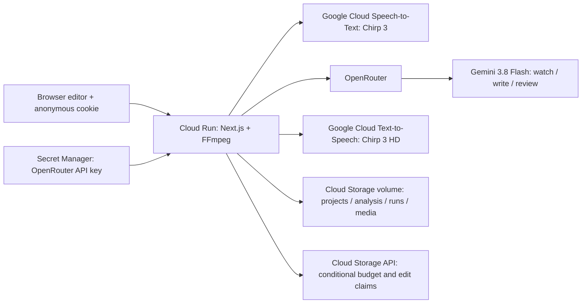

# Deployed architecture

The application is a Next.js 16.3.5 / React server and editor on Google Cloud Run in `asia-northeast3`, with FFmpeg in the container. The existing service uses 2 vCPU, 2 GiB RAM, concurrency 10, a 900-second request timeout and at most two instances. This is short-clip processing in a request, not a durable queue or long-film worker service.

Google APIs use the Cloud Run service account through metadata credentials. Local speech calls use the selected gcloud configuration. Cloud Storage atomic writes use application default credentials on the deployed service. Gemini calls use OpenRouter; this deployment does not use Vertex AI for inference, ADK, or Agent Engine.

## Generation

The server emits append-only SSE events and writes a per-call JSONL ledger. STT and visual analysis run independently and save each validated component before drafting. The cache key hashes the clip bytes, spoken language, duration, model and analysis version. Legacy unkeyed analysis is display-only and is not trusted for a new run.

Speech and protected sound intervals define allowed gaps. Writer placements must name the gap containing their start; there is no relocation fallback. Each cue gets a window ending at the next cue or gap end. Review validates unique, exhaustive cue IDs and consistent pass/fail results. An unchanged rejected rewrite is dropped. Automatic generation has bounded review and shortening rounds. Actual waveform lengths are used for fit checks, then a final audit checks the surviving output once. Its findings remain in the summary and UI.

## Edits

An edit references an immutable parent run. The server computes its legal start range from neighboring PCM lengths, synthesizes only the edited sentence at normal speed, and reviews the final script with actual endpoints. It returns a reason if the human text fails or exceeds its available room. It never silently rewrites human text. Accepted edits copy unchanged WAVs, rebuild the mix and captions, and save a child script with provenance. A dropped sentence may be restored when the edited voice fits its original gap.

The request ID claim is scoped to session, project and parent. Cloud Storage conditional writes reject simultaneous claims. Successful repeats return the same run. Pending claims after a process crash fail closed; this is deliberate protection against duplicate paid work, not automatic job recovery.

## Trust and persistence

Project metadata contains a session-token hash for uploads. Authorization occurs before every data-bearing route, and private responses use no-store caching. The media route allowlists only the intended exports and per-line WAVs. Public sample results are visible to everyone. Anonymous ownership does not provide team collaboration, accounts, recovery or long-term identity.

Daily budget reservations use `ifGenerationMatch`, not read/modify/write through GCS FUSE. Both concurrent claims and settlement are idempotent. Unknown provider charges retain their reserved amount. Speech prices are estimates, OpenRouter costs use response usage, and infrastructure costs are outside the API subtotal. There is no recharge automation.

Runtime media and evaluation artifacts are outside Git. Source deploys exclude credentials, runtime files, browser artifacts and local build outputs. GitHub publishing and contest submission are separate owner actions.
